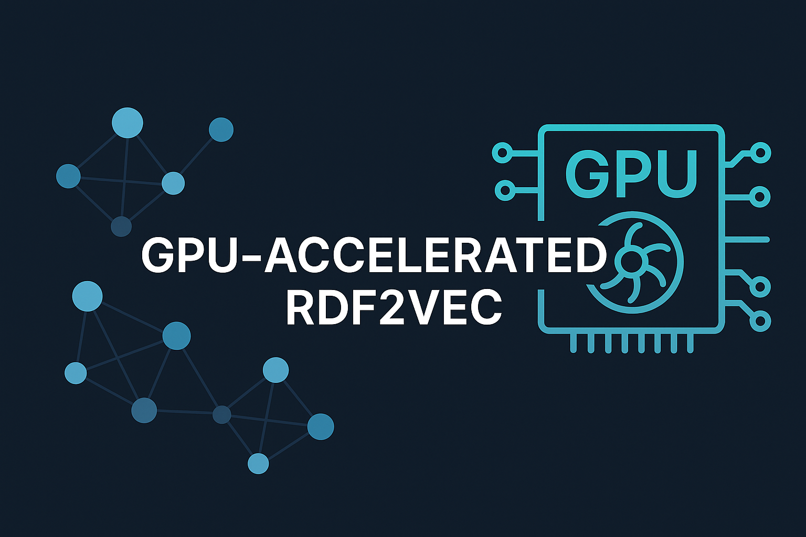

## RDF2Vec GPU


The different aspects of the repository can be found here:
- [RDF2Vec GPU](#rdf2vec-gpu)
- [Library setup](#library-setup)
- [gpuRDF2Vec overview](#gpurdf2vec-overview)
  - [Capability overview](#capability-overview)
  - [Runtime comparison to other RDF2Vec packages](#runtime-comparison-to-other-rdf2vec-packages)
- [Dependencies](#dependencies)
- [Usage example](#usage-example)
- [Roadmap](#roadmap)
- [Report issues and bugs](#report-issues-and-bugs)

## Library setup

Pytorch [installation page](https://pytorch.org/get-started/locally/)


Cuda 12.6 installation

```bash
pip install torch torchvision torchaudio
```

Detailed cudf installation instruction [here](https://docs.rapids.ai/install/).

Cudf Cuda 12 install
```bash
pip install \
    --extra-index-url=https://pypi.nvidia.com \
    "cudf-cu12==25.4.*" "dask-cudf-cu12==25.4.*" \
    "cugraph-cu12==25.4.*" "nx-cugraph-cu12==25.4.*" \
    "nx-cugraph-cu12==25.4.*"
```
## gpuRDF2Vec overview
### Capability overview
### Runtime comparison to other RDF2Vec packages

## Dependencies

## Usage example
```python
# Instantiate the gpu RDF2Vec library settings
gpu_rdf2vec_model = GPU_RDF2Vec(
    walk_strategy="random",
    walk_depth=4,
    walk_number=100,
    embedding_model="skipgram",
    epochs=5,
    batch_size=None,
    vector_size=100,
    window_size=5,
    min_count=1,
    learning_rate=0.01,
    negative_samples=5,
    random_state=42,
    reproducible=False,
    multi_gpu=False,
    generate_artifact=False,
    cpu_count=20
)
# Path to the triple dataset
path = "data/wikidata5m/wikidata5m_kg.parquet"
# Load data and receive edge data
edge_data = gpu_rdf2vec_model.load_data(path)
# Fit the Word2Vec model and transform the dataset to an embedding
embeddings = gpu_rdf2vec_model.fit_transform(edge_df=edge_data, walk_vertices=None)
# Write embedding to file format. Return format is a cuDf dataframe
embeddings.to_parquet("data/wikidata5m/wikidata5m_embeddings.parquet", index=False)
```

## Roadmap
- [ ] Order aware Word2Vec following the details of 
- [ ] Provide spilling to single GPU training to work around potential OOM issues
- [ ] 
## Report issues and bugs
