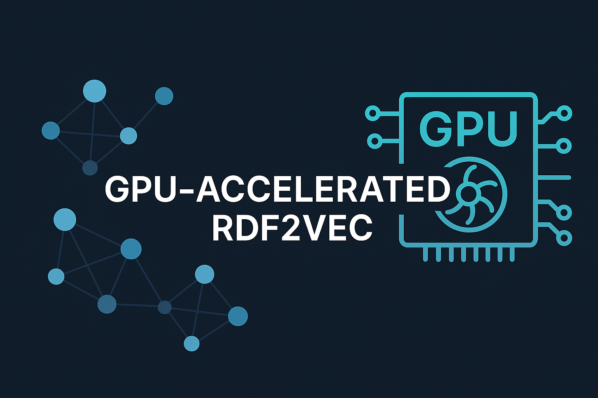

## gpuRDF2Vec

A scalable GPU based implementation of RDF2Vec embeddings for large and dense Knowledge Graphs.

[](https://opensource.org/licenses/MIT)



> [!IMPORTANT]
> This package is under active development in the beta phase. The overall class/ method design will most probably change and introduce breaking changes between releases

## Table of contents

The content of this repository readme can be found here:

- [gpuRDF2Vec](#gpurdf2vec)
- [Table of contents](#table-of-contents)
- [Package installation](#package-installation)
- [Repository setup](#repository-setup)
- [gpuRDF2Vec overview](#gpurdf2vec-overview)
  - [Repository Structure](#repository-structure)
  - [Capability overview](#capability-overview)
- [Quick start](#quick-start)
- [Implementation Details](#implementation-details)
- [License](#license)
- [Roadmap](#roadmap)
- [Report issues and bugs](#report-issues-and-bugs)

## Package installation

Install the package rdf2vecgpu by running the following command:

```
pip install rdf2vecgpu
```

> [!IMPORTANT]
> Make sure to install the accompanying cuda version as outlined in the [following section](#repository-setup)

## Repository setup

The repository setup builds on top of two major libraries. Both Pytorch lightning as well as the RAPIDS libraries cuDF and cuGraph. We provide the exeplanatory installation details for Cuda 12.6:

1. Pytorch [installation page](https://pytorch.org/get-started/locally/)
Cuda 12.6 installation

```bash
pip install torch torchvision torchaudio
```

2. Detailed cudf installation instruction [here](https://docs.rapids.ai/install/).
Cudf Cuda 12 install

```bash
pip install \
    --extra-index-url=https://pypi.nvidia.com \
    "cudf-cu12==25.4.*" "dask-cudf-cu12==25.4.*" \
    "cugraph-cu12==25.4.*" "nx-cugraph-cu12==25.4.*" \
    "nx-cugraph-cu12==25.4.*"
```

The requirement files and conda environment files can be found here:

- [Conda environment](performance/env_files/rdf2vecgpu_environment.yml)
- [Requirement file](performance/env_files/rdf2vecgpu_requirements.txt)

## gpuRDF2Vec overview

RDF2Vec is a powerful technique to generate vector embeddings of entities in RDF graphs via random walks and Word2Vec. This repository provides a GPU-optimized reimplementation, enabling:

- **Speedups** on dense graphs with millions of nodes
- **Scalability** to industrial-scale knowledge bases
- **Reproducible experiments** to test and qualify the overall implementation details

### Repository Structure

```bash
.
├── README.md
├── data
├── data_preparation
│   ├── converstion_to_ttl.py
│   └── merge_text_file.py
├── img
│   └── github_repo_header.png
├── jrdf2vec-1.3-SNAPSHOT.jar
├── performance
│   ├── env_files
│   │   ├── jrdf2vec_environment.yml
│   │   ├── jrdf2vec_requirements.txt
│   │   ├── pyrdf2vec_environment.yml
│   │   ├── pyrdf2vec_requirements.txt
│   │   ├── rdf2vecgpu_environment.yml
│   │   ├── rdf2vecgpu_requirements.txt
│   │   ├── sparkrdf2vec_environment.yml
│   │   └── sparkrdf2vec_requirements.txt
│   ├── evaluation_parameters.py
│   ├── gpu_rdf2vec_performance.py
│   ├── graph_creation.py
│   ├── graph_statistics.py
│   ├── jrdf2vec_based_performance.py
│   ├── pyrdf2vec_based_performance.py
│   ├── spark_rdf2vec_performance.py
│   └── wandb_analysis.py
├── src
│   ├── __init__.py
│   ├── corpus
│   │   ├── __init__.py
│   │   └── walk_corpus.py
│   ├── cpu_based_rdf2vec_approach.py
│   ├── embedders
│   │   ├── __init__.py
│   │   ├── word2vec.py
│   │   └── word2vec_loader.py
│   ├── gpu_rdf2vec.py
│   ├── helper
│   │   ├── __init__.py
│   │   └── functions.py
│   └── reader
│       ├── __init__.py
│       └── kg_reader.py
└── test
    ├── helper
    └── reader
        ├── functions_test.py
        └── kg_reader_test.py
```

### Capability overview

- GPU-backed walk generation over CUDA Kernels
- Batched Word2Vec training with Pytorch lightning
- Pluggable rdf loaders and parquet, csv, txt integration
- Performance comparison can be found in the following [folder](performance/)

## Quick start

```python
from rdf2vecgpu import GPU_RDF2Vec, RDF2VecConfig

# Bundle all hyperparameters in a config object
config = RDF2VecConfig(
    walk_strategy="random",
    walk_depth=4,
    walk_number=100,
    embedding_model="skipgram",
    epochs=5,
    batch_size=None,
    vector_size=100,
    window_size=5,
    min_count=1,
    learning_rate=0.01,
    negative_samples=5,
    random_state=42,
    reproducible=False,
    multi_gpu=False,
    generate_artifact=False,
    cpu_count=20,
)

# Instantiate the pipeline
gpu_rdf2vec_model = GPU_RDF2Vec(config=config)

# Path to the triple dataset
path = "data/wikidata5m/wikidata5m_kg.parquet"

# Read data and receive edge data
edge_data = gpu_rdf2vec_model.read_data(path)

# Fit the Word2Vec model and transform the dataset to an embedding
embeddings = gpu_rdf2vec_model.fit_transform(edge_df=edge_data, walk_vertices=None)

# Write embedding to file format. Return format is a cuDF dataframe
embeddings.to_parquet("data/wikidata5m/wikidata5m_embeddings.parquet", index=False)
```

- Supported file formats:
  - `.csv`
  - `.parquet`
  - `.orc`
  - `.nt`, `.nq`
  - All supported [RDFlib file formats](https://rdflib.readthedocs.io/en/stable/plugin_parsers.html)
- Core `RDF2VecConfig` parameters (see [Configuration reference](https://rdf2vecgpu.readthedocs.io/en/latest/configuration.html) for the full list):
  - `walk_strategy`: `["random", "bfs"]`
  - `walk_depth`: `int`
  - `walk_number`: `int`
  - `walk_weighted`: `bool` (uses cuGraph biased random walks; requires a `weights` column)
  - `embedding_model`: `["skipgram", "cbow"]`
  - `epochs`: `int`
  - `batch_size`: `int | None` — if `None`, a heuristic batch size is picked based on the data loader and the available GPU memory
  - `vector_size`: `int`
  - `window_size`: `int`
  - `min_count`: `int`
  - `learning_rate`: `float`
  - `negative_samples`: `int`
  - `random_state`: `int`
  - `reproducible`: `bool`
  - `multi_gpu`: `bool`
  - `generate_artifact`: `bool`
  - `cpu_count`: `int`
  - `literal_predicates`, `literal_strategy`, `literal_n_bins`, `literal_bin_strategy` — see the literal handling section of the docs
  - `tracker`: `["none", "mlflow", "wandb"]` — pluggable experiment tracking backend

### Optional extras

The experiment tracking backends and the test suite are opt-in:

```bash
pip install "rdf2vecgpu[mlflow]"
pip install "rdf2vecgpu[wandb]"
pip install "rdf2vecgpu[test]"
```

## Implementation Details

We achieve order-of-magnitude for large and dense graphs over CPU-bound RDF2Vec by engineering both the **walk extraction** and the **Word2Vec training** pipelines:

1. **GPU-Native Walk Extraction**  
   - All random-walk and BFS operations leverage cuDF/cuGraph kernels to avoid CPU–GPU data transfers and minimize latency.  
   - To generate *k* walks per node in one pass, we replicate node indices in a single cuDF DataFrame rather than looping—fully utilizing GPU parallelism and eliminating Python-loop overhead (∼15× speedup).  
   - BFS walks currently use GPU-side recursive joins; future work will reconstruct walks entirely in CUDA to remove join overhead.

2. **cuDF→PyTorch Lightning Handoff**  
   - Replaced Lightning’s default CPU-based DataLoader with a cuDF-backed pipeline: context/center columns live on GPU as DLPack tensors.  
   - Initial deep-copy loads incur extra VRAM, but thereafter all sampling/preprocessing occurs on-device, eliminating PCIe stalls.  
   - An “index-only” strategy (workers pull tensor indices instead of slices) uses CUDA’s pointer arithmetic for constant-time access, collapsing DataLoader overhead from ~85% of epoch time to near parity with model compute.

3. **Optimized Word2Vec Training**  
   - **Batch-Size Heuristic:** Estimate per-sample GPU footprint from cuDF loader, then set initial batch = (total VRAM) / (4 × footprint). This “divide-by-four” rule quickly homes in on a viable batch size, reducing tuning runs.  
   - **Kernel Fusion:** All sampling and tensor transforms migrated into PyTorch’s C++ back end, removing Python loops and the GIL, for consistent high throughput.  

4. **Scalable Data-Parallel Training**  
   - We use PyTorch Distributed + NCCL: each GPU holds the same graph shard but a unique walk corpus.  
   - Gradients are synchronized via `all_reduce` at regular intervals (~500 ms), amortizing PCIe/NVLink costs and ensuring linear scaling across nodes.

5. **Distributed correctness — when to `persist`**

   The multi-GPU code paths use `dask_cudf` for the vocab build, the
   broadcast-encode of edge triples, and the random-walk reshape. Two patterns
   are easy to get wrong and produce silent data drift rather than visible
   crashes; both are documented inline at the relevant call sites and re-stated
   here for contributors.

   **(a) Any non-deterministic dask output that is read more than once must be
   `.persist()`-ed before the second consumer.** Examples:

   - `MultiGPUWalkCorpus.random_walk` persists the cuGraph walk output before
     it computes per-partition sizes for the reshape (see
     `corpus/walk_corpus.py` around the `walks_s.persist()` call).
   - `_generate_vocab` persists the post-shuffle deduplicated vocabulary
     before reading partition sizes for the `cumsum` offsets that drive the
     per-partition `cupy.arange` token assignment (see
     `helper/functions.py` around the `vocabulary_df.persist()` call).

     Without persist, every consumer triggers a re-roll of the underlying
     hash-shuffle / random-walk generator. Because `drop_duplicates` over a
     non-deterministic shuffle is itself non-deterministic, partition
     assignments drift between rolls — we observed 23 M → 15 M row loss
     between a partition-sizes pass and the eventual write on the standalone
     tool that pioneered this pattern.

   **(b) When using `.merge()` against a small table, prefer `broadcast=True`.**
   Without it, dask defaults to a hash-shuffle join. With a small right-side
   partition count, the large left side gets funneled through a single worker
   — observed 6+ hours at 100 % single-GPU utilization on Wikidata-scale
   `_generate_vocab` runs before this fix landed. `broadcast=True` replicates
   the small side to every worker so each large-side partition does a local
   hash join with no shuffle.

   **Compatibility patches.** `_compat.apply_patches()` (called from
   `GPU_RDF2Vec.__init__` when `multi_gpu=True`) currently fixes two upstream
   issues that are still alive at the cuGraph 25.6 / dask >= 2025.5 versions
   we pin:

   - `_patch_convert_to_cudf` — `cugraph.dask`'s random-walk
     `convert_to_cudf` helper crashes on `renumber=False` graphs because it
     unconditionally dereferences `number_map.implementation.numbered`.
   - `_patch_dask_cudf_from_cudf` — works around a dask-expr backend
     breakage in dask >= 2025.5 that affects `dask_cudf.from_cudf`.

   Both patches are self-contained workarounds; the long-term fix is upstream
   in cuGraph / dask-cudf. Track those there and remove the patches once they
   land.

## License

The overview of the used MIT license can be found [here](LICENSE)

## Roadmap

- [ ] Order aware Word2Vec following the details of [Ling, Wang, et al. "Two/too simple adaptations of word2vec for syntax problems.](https://aclanthology.org/N15-1142.pdf). [Issue item](https://github.com/MartinBoeckling/rdf2vecgpu/issues/2)
- [ ] Provide spilling to single GPU training to work around potential OOM issues faced during rdf2vec training [Issue Item](https://github.com/MartinBoeckling/rdf2vecgpu/issues/3)
- [X] Provide weighted walks for spatial datasets [Issue item](https://github.com/MartinBoeckling/rdf2vecgpu/issues/4)
- [X] Provide logging capabilities of complete Word2Vec pipeline for [Wandb](https://wandb.ai/site/) and [mlflow](https://mlflow.org/). [Issue item](https://github.com/MartinBoeckling/rdf2vecgpu/issues/5)
- [ ] Optional gensim Word2Vec trainer backend (`train_backend="gensim"`)
  alongside the default PyTorch Lightning trainer. The gensim C path is
  5–10× faster on CPU for very large corpora (~390 M-token vocab,
  multi-billion walks) and supports constant-memory streaming via
  `pyarrow.parquet.ParquetFile.iter_batches`. Useful when running on a
  CPU-rich + GPU-light box where the PyTorch trainer is bottlenecked on
  data movement rather than compute.

## Report issues and bugs

In case you have found a bug or unexpected behaviour, please reach out by opening an issue:

1. When opening an issue, please tag the issue with the label **Bug**. Please include the following information:
    - **Environment**: OS, Python/CUDA/PyTorch/RAPIDS versions (cuDF, cuGraph)
    - **Reproduction steps**: Exact commands or small code snippet
    - **Input data** graph format & size (attach a minimal sample if possible)
    - **Observed vs. expected behavior**
    - **Error messages/ stack traces** (copy-paste or attach logs)

2. We aim to respond to open issues within 3 business days
3. If you have identified a fix, fork the repo, branch off `main`, implement & test then open a PR referencing the issue.

## Citation

If you use gpuRDF2Vec in your research, please cite the following paper:

```bibtex
@InProceedings{10.1007/978-3-032-09530-5_14,
  author="B{\"o}ckling, Martin and Paulheim, Heiko",
  editor="Garijo, Daniel
  and Kirrane, Sabrina
  and Salatino, Angelo
  and Shimizu, Cogan
  and Acosta, Maribel
  and Nuzzolese, Andrea Giovanni
  and Ferrada, Sebasti{\'a}n
  and Soulard, Thibaut
  and Kozaki, Kouji
  and Takeda, Hideaki
  and Gentile, Anna Lisa",
  title="gpuRDF2vec -- Scalable GPU-Based RDF2vec",
  booktitle="The Semantic Web -- ISWC 2025",
  year="2026",
  publisher="Springer Nature Switzerland",
  address="Cham",
  pages="240--257",
  isbn="978-3-032-09530-5"
}


```
